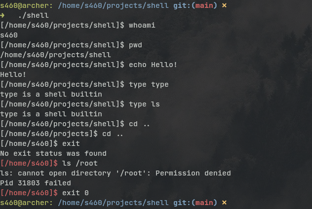

# c-shell
This is a simple "shell" written purely in C. It's done as an exercise to understand the inner workings of linux shells and to get used to the C standart library.

As a start I used the codecrafters "Build your own shell" assignments.

## Sample output

## Things to add
- makefile
- evaluation of ENV variables
- comments (in the shell)
- update the builtin system

## Valgrind
- still reachable at the end of the program is because of calling exit before freeing some resources